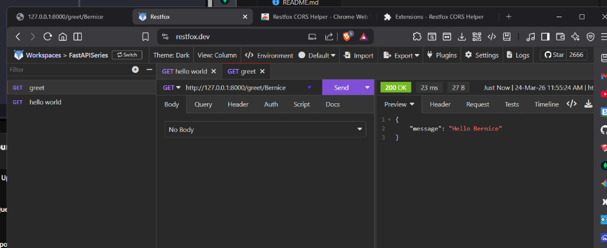
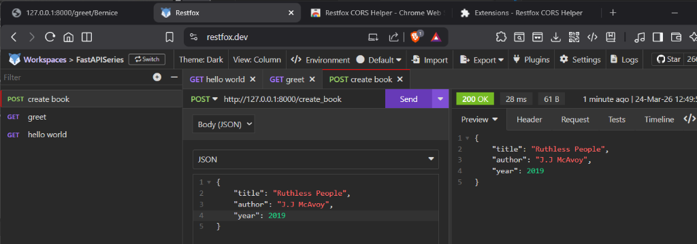
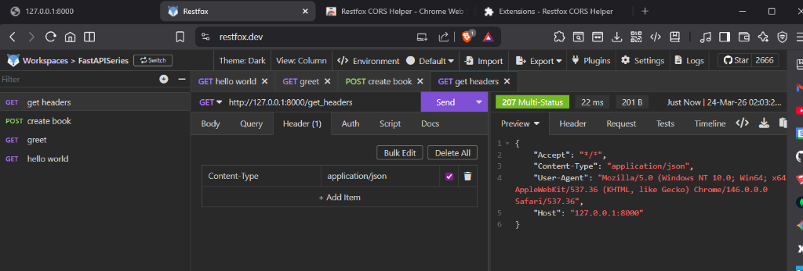
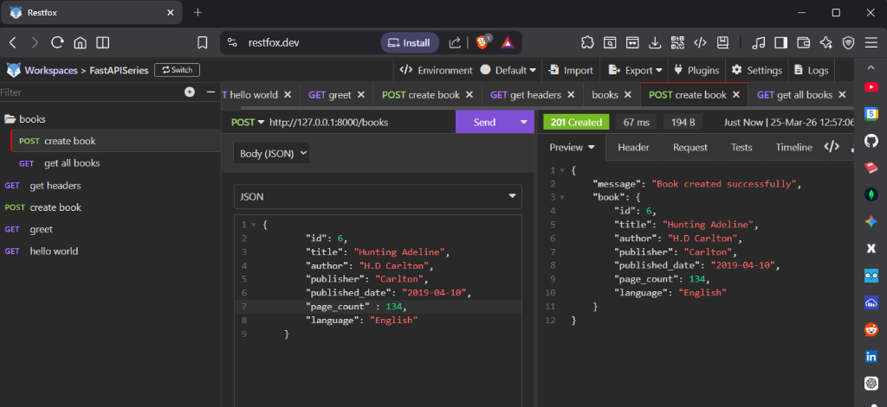

# FastAPI Beyond CRUD 🚀

Hey! Welcome to my **FastAPI Beyond CRUD** project. I'm building this by following a youtube tutorial to go deeper into FastAPI and build some cool stuff beyond the basics.

## What's new?
I just added a new dynamic endpoint to greet users! It takes a name as a path parameter and sends back a nice little JSON greeting.

Here is the endpoint I added:
```python
@app.get("/greet/{name}")
async def greet(name: str) -> dict:
    return {"message": f"Hello {name}"}
```

## Testing with Restfox 🦊
To make sure everything is working perfectly, I spun up the local dev server (`fastapi dev main.py`) and gave the new endpoint a quick test using **Restfox**. 

As you can see below, hitting `http://127.0.0.1:8000/greet/Bernice` works like a charm! ✨



## Creating a Book
I've also built a `POST /create_book` endpoint that accepts Pydantic `BaseModel` data (title, author, year). 



## Fetching Custom Headers
And finally, a `/get_headers` endpoint that grabs request headers and returns them with a `207 Multi-Status` response!



## Book Management API
- `GET /books`: Lists all current books.
- `POST /books`: Creates a new book using Pydantic models (`201 Created`).
- `GET /books/{book_id}`: Retrieves a specific book by its ID.
- `PATCH /books/{book_id}`: Partially updates a book's information.
- `DELETE /books/{book_id}`: Deletes a book from the system.


